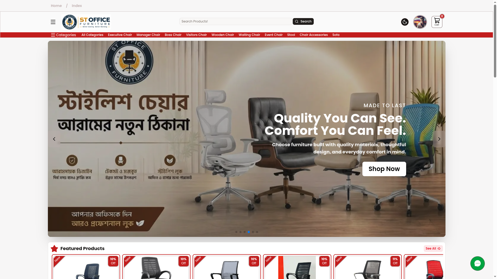
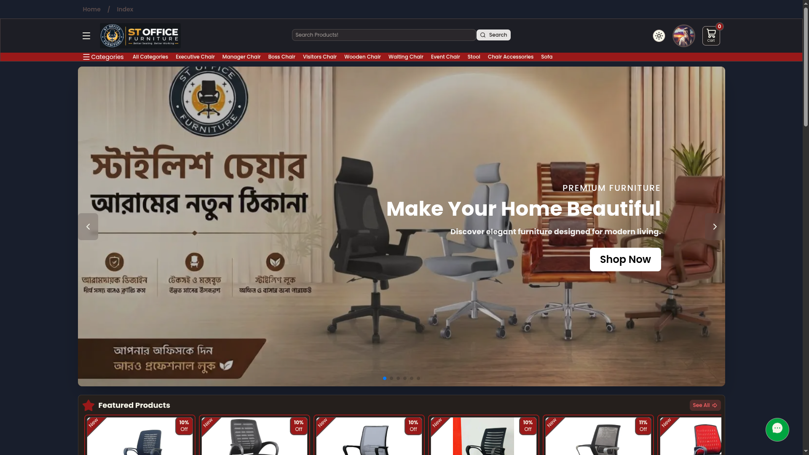
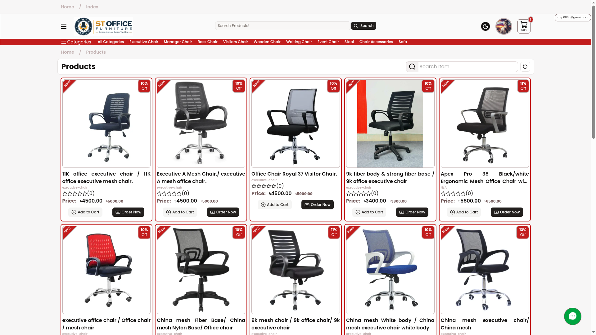
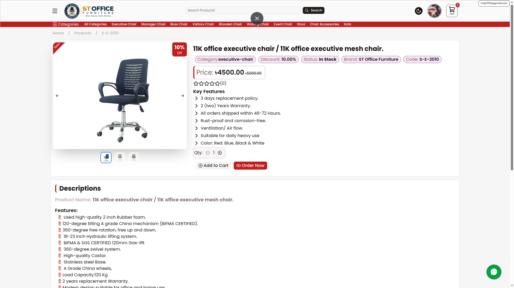
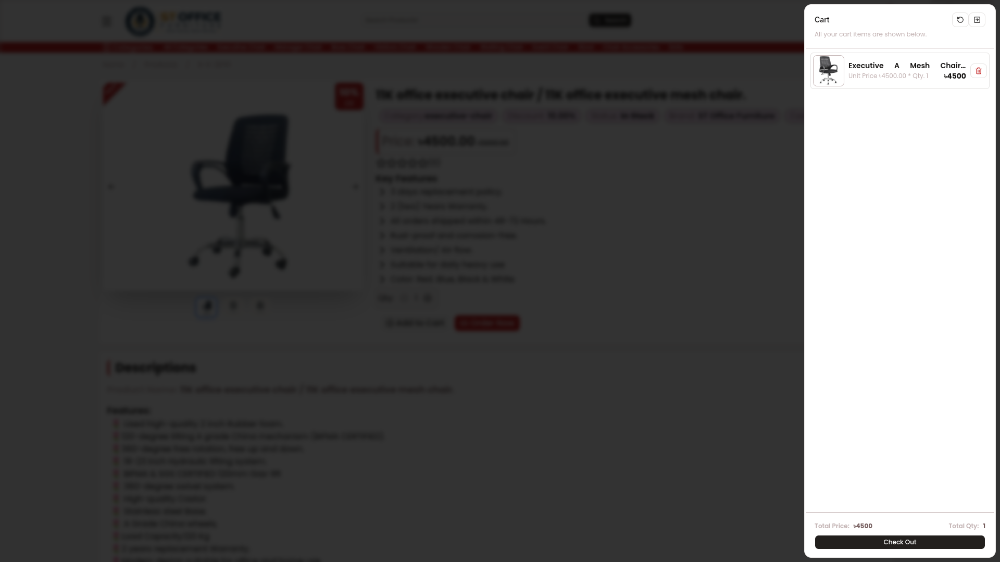
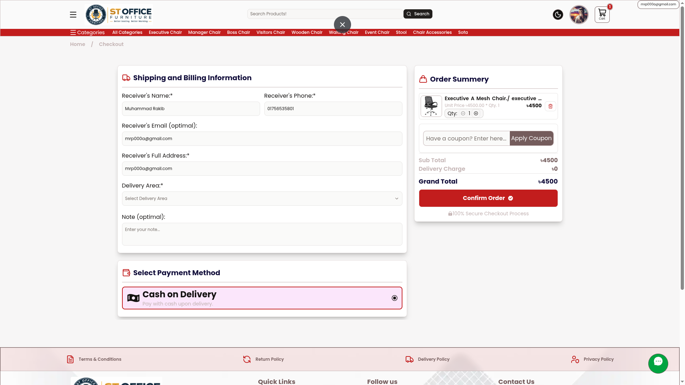
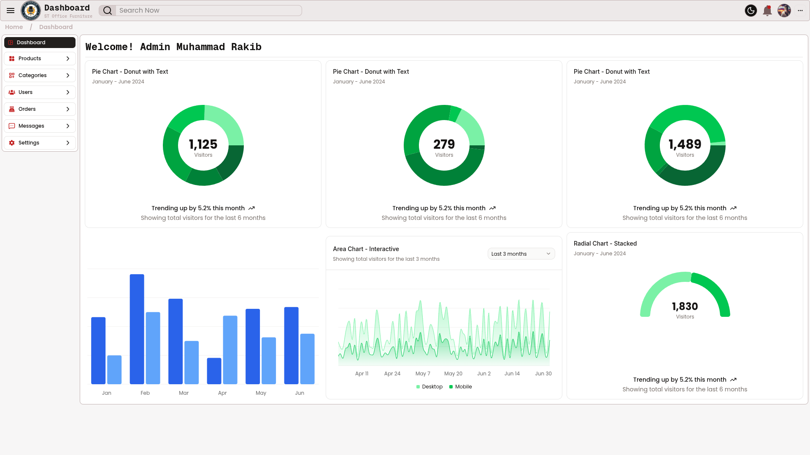

# 🪑 ST Office Furniture

> A modern, full-stack e-commerce platform for office furniture, chairs, sofas, and seating accessories.

**ST Office Furniture** is a production-oriented e-commerce web application built with **Next.js, TypeScript, PostgreSQL, Prisma, Redux Toolkit, Cloudflare R2, and Resend**.

The platform provides customers with a modern and responsive shopping experience while providing administrators with tools to manage products, categories, orders, users, and other business operations.

---

## 🌐 Live Website

**Website:** https://www.stofficefurniture.com

---

## 📸 Screenshots

> Add screenshots of your application here.

### 🏠 Homepage




### 🛍️ Products



### 📦 Product Details



### 🛒 Shopping Cart



### 💳 Checkout



### ⚙️ Admin Dashboard



> These are some screenshots of my project

---

# ✨ Features

## 🛍️ Customer Features

- Browse furniture products
- Browse products by category
- Search products
- Product pagination
- Product details page
- Product images and galleries
- Product ratings and reviews
- Shopping cart
- Quantity management
- Guest cart support
- User account management
- Order placement
- Order history
- Order status tracking
- Delivery area selection
- Delivery charge calculation
- Customer notes during checkout
- Responsive design
- Light and dark mode
- Transactional email notifications

---

## 👨‍💼 Admin Features

- Admin authentication
- Dashboard
- Product management
- Category management
- Product image management
- Product stock management
- Product pricing and discount management
- Order management
- Order status updates
- Customer information management
- Delivery area management
- User management
- Role-based access control

### Order Statuses

The application supports the following order statuses:

```text
PENDING
CONFIRMED
PACKAGED
ON_HOLD
SHIPPED
RETURNED
FAILED_DELIVERY
DELIVERED
CANCELLED
```

---

# 🧑‍💻 Tech Stack

## Frontend

| Technology      | Purpose                    |
| --------------- | -------------------------- |
| Next.js         | Full-stack React framework |
| React           | User interface             |
| TypeScript      | Type safety                |
| Tailwind CSS    | Styling                    |
| shadcn/ui       | UI components              |
| React Hook Form | Form management            |
| Zod             | Validation                 |
| Swiper          | Image/hero sliders         |

## Backend

| Technology             | Purpose              |
| ---------------------- | -------------------- |
| Next.js Route Handlers | API endpoints        |
| NextAuth.js            | Authentication       |
| Prisma                 | Database ORM         |
| PostgreSQL             | Relational database  |
| Resend                 | Transactional emails |
| Cloudflare R2          | Object/file storage  |

## State Management

```text
Redux Toolkit
React Context
```

Redux Toolkit is used primarily for client-side shopping cart state and related application state.

## Deployment

```text
Vercel
Cloudflare DNS
Cloudflare R2
PostgreSQL
```

---

# 🏗️ Architecture

The application follows a modern full-stack Next.js architecture.

```text
┌─────────────────────────────┐
│          Customer           │
│     Web Browser / Mobile    │
└──────────────┬──────────────┘
               │
               ▼
┌─────────────────────────────┐
│         Next.js App         │
│                             │
│  App Router                 │
│  Server Components          │
│  Client Components          │
│  Route Handlers             │
└───────┬─────────┬───────────┘
        │         │
        │         │
        ▼         ▼
┌────────────┐  ┌────────────┐
│ PostgreSQL │  │ Cloudflare │
│ + Prisma   │  │     R2     │
└────────────┘  └────────────┘
        │
        ▼
┌─────────────────────────────┐
│          Resend             │
│   Transactional Emails      │
└─────────────────────────────┘
```

---

# 🚀 Getting Started

Follow the steps below to run the project locally.

## 1. Clone the Repository

```bash
git clone <your-repository-url>
```

Move into the project directory:

```bash
cd st-office
```

---

## 2. Install Dependencies

Using npm:

```bash
npm install
```

Or using pnpm:

```bash
pnpm install
```

---

# 🔐 Environment Variables

Create a `.env` file in the root directory.

```bash
touch .env
```

Then configure the required environment variables.

Never commit your actual `.env` file.

Make sure `.gitignore` contains:

```gitignore
.env
.env.local
.env.production
.env*.local
```

### Example

```env
DATABASE_URL=

NEXTAUTH_SECRET=
NEXTAUTH_URL=

R2_ACCOUNT_ID=
R2_ACCESS_KEY_ID=
R2_SECRET_ACCESS_KEY=
R2_BUCKET_NAME=
NEXT_PUBLIC_URL_R2=

RESEND_API_KEY=

NEXT_PUBLIC_APP_URL=
```

---

# 🗄️ Database Setup

This project uses **PostgreSQL** with **Prisma ORM**.

After configuring `DATABASE_URL`, generate the Prisma client:

```bash
npx prisma generate
```

For local development, apply your database schema:

```bash
npx prisma migrate dev
```

If you need to create a new migration:

```bash
npx prisma migrate dev --name your_migration_name
```

For production:

```bash
npx prisma migrate deploy
```

---

<!-- # 🌱 Database Seeding -->
<!--
If the project contains a seed script, run:

```bash
npx prisma db seed
``` -->

You can also inspect the database using Prisma Studio:

```bash
npx prisma studio
```

---

# ▶️ Run the Development Server

Start the development server:

```bash
npm run dev
```

The application will normally be available at:

```text
http://localhost:3000
```

---

# 🏭 Production Build

Create a production build:

```bash
npm run build
```

Start the production server:

```bash
npm start
```

---

# 🔄 Available Scripts

Typical project scripts include:

```bash
npm run dev
npm run build
npm start
npm run lint
```

| Command         | Description              |
| --------------- | ------------------------ |
| `npm run dev`   | Start development server |
| `npm run build` | Create production build  |
| `npm start`     | Start production server  |
| `npm run lint`  | Run ESLint               |

---

# 🔑 Authentication

Authentication is implemented using **NextAuth.js**.

The application supports authenticated users and role-based authorization.

Example roles:

```text
USER
ADMIN
SUPER_ADMIN
```

Protected functionality is available only to authorized users.

Authentication is handled through secure server-side session management.

---

# 🛒 Shopping Cart

The shopping cart uses **Redux Toolkit** for client-side state management.

The application supports:

- Adding products
- Removing products
- Updating products
- Calculating totals
- Managing guest carts
- Synchronizing authenticated user carts with the database

A simplified cart flow:

```text
Customer
   │
   ▼
Add Product
   │
   ▼
Redux Cart
   │
   ├── Guest User
   │      └── Client-side cart
   │
   └── Authenticated User
          └── Database cart
```

---

# 📦 Order System

Customers can place orders through the checkout system.

The checkout process collects information such as:

```text
Receiver Name
Phone
Email
Address
Delivery Area
Customer Note
```

The system calculates applicable delivery charges and creates the order.

After an order is successfully created, transactional email notifications can be sent through Resend.

---

# 📧 Email System

The project uses **Resend** for transactional emails.

Examples include:

- Order confirmation
- Customer notifications
- Email verification
- Contact form notifications

Example sender:

```text
ST Office Furniture <orders@stofficefurniture.com>
```

The production domain is configured for email delivery through DNS authentication.

> Make sure your Resend API key and verified sending domain are configured before sending emails in production.

---

# 🖼️ Image Storage

Product images are stored using **Cloudflare R2**.

The application can upload images to R2 and store their object keys in the database.

Example:

```text
r2upload/products/images/product-image.jpg
```

This keeps large media files separate from the application server and database.

---

# 🔍 Product Management

Products can contain information such as:

```text
Title
Product Code
Brand
Description
Key Features
Price
Discount Price
Discount
Stock
Category
Images
Reviews
```

The product system is designed to support furniture-specific information while remaining flexible for future product variations.

---

# ⭐ Reviews & Ratings

Customers can submit product reviews and ratings.

The rating system supports fractional values such as:

```text
5.0 ⭐⭐⭐⭐⭐
4.5 ⭐⭐⭐⭐½
4.0 ⭐⭐⭐⭐
3.5 ⭐⭐⭐½
```

Ratings can be displayed dynamically based on the stored value.

---

# 🎨 UI & Design

The application uses:

- Tailwind CSS
- shadcn/ui
- Responsive layouts
- Dark mode
- Light mode
- Accessible UI components
- Responsive navigation
- Product cards
- Interactive dialogs/drawers
- Responsive tables
- Mobile-friendly checkout

The interface is designed to work across:

```text
📱 Mobile
💻 Desktop
🖥️ Large Screens
```

---

# ⚡ Performance

Performance considerations include:

- Next.js Server Components
- Image optimization
- Responsive image sizing
- Lazy loading
- Caching and revalidation
- Server-side data fetching
- Optimized database queries
- Cloud object storage for media

The application aims to minimize unnecessary client-side JavaScript while keeping interactive functionality where it is needed.

---

# 🔒 Security Considerations

The project follows common web application security practices, including:

- Environment variables for secrets
- Server-side authorization
- Role-based access control
- Authentication-protected routes
- Input validation
- Database constraints
- Secure API handling
- Restricted administrative functionality
- Avoiding exposure of private credentials

### Never expose:

```text
DATABASE_URL
NEXTAUTH_SECRET
RESEND_API_KEY
R2_SECRET_ACCESS_KEY
R2_ACCESS_KEY_ID
```

---

# 🌍 Deployment

The application is designed to be deployed on **Vercel**.

Typical deployment flow:

```text
GitHub
   │
   ▼
Vercel
   │
   ├── Next.js Application
   │
   └── Environment Variables
          │
          ├── PostgreSQL
          ├── Cloudflare R2
          ├── Resend
          └── NextAuth
```

## Production Database

Before deploying database changes:

```bash
npx prisma migrate deploy
```

Then build the application:

```bash
npm run build
```

---

# ☁️ Cloudflare Configuration

Cloudflare is used for infrastructure such as:

- DNS
- Domain management
- R2 object storage
- Email routing

The production domain is:

```text
stofficefurniture.com
```

---

# 📡 API

The application uses Next.js Route Handlers for backend functionality.

Example API structure:

```text
/api
├── auth
├── products
├── categories
├── cart
├── order
├── reviews
├── users
└── ...
```

API routes are responsible for operations such as:

- Fetching products
- Creating products
- Updating products
- Managing categories
- Managing carts
- Creating orders
- Updating orders
- Managing reviews
- Uploading files

---

# 🧪 Development Workflow

Recommended development workflow:

```text
1. Create feature branch
        ↓
2. Develop locally
        ↓
3. Test functionality
        ↓
4. Run lint
        ↓
5. Run production build
        ↓
6. Commit changes
        ↓
7. Push to GitHub
        ↓
8. Deploy through Vercel
```

Before pushing:

```bash
npm run lint
npm run build
```

---

# 🛣️ Roadmap

Possible future improvements include:

- [ ] Online payment integration
- [ ] Advanced product filtering
- [ ] Product variants
- [ ] Wishlist
- [ ] Coupon and discount system
- [ ] Customer notification system
- [ ] Push notifications
- [ ] Advanced analytics dashboard
- [ ] Sales reports
- [ ] Inventory management
- [ ] Invoice generation
- [ ] Multi-language support
- [ ] SEO improvements
- [ ] Product recommendations
- [ ] Improved search
- [ ] Progressive Web App support

---

# 🤝 Contributing

Contributions are welcome.

To contribute:

```bash
git clone <your-repository-url>
cd st-office
npm install
```

Create a new branch:

```bash
git checkout -b feature/your-feature
```

Make your changes and test them:

```bash
npm run lint
npm run build
```

Commit your changes:

```bash
git add .
git commit -m "feat: add your feature"
```

Push the branch:

```bash
git push origin feature/your-feature
```

Then open a Pull Request.

---

# 📄 License

This project is currently maintained as a private/business project.

If you intend to open-source the project, add an appropriate license such as MIT:

```text
MIT License
```

---

# 👨‍💻 Developer

**Muhammad Rakib**

BBA (Accounting & Information Systems) student at the University of Rajshahi and full-stack web developer.

### Technologies & Interests

```text
HTML
CSS
JavaScript
TypeScript
React
Next.js
Node.js
Express.js
Tailwind CSS
PostgreSQL
MongoDB
Prisma
Redux Toolkit
Cloudflare
Vercel
AI-powered Web Development
```

---

# 📬 Contact

For business or technical inquiries, please use the contact information provided on the official website.

**ST Office Furniture**

🌐 https://mrp-dev.vercel.app/

---

## ⭐ Acknowledgement

This project was built using modern web technologies with a focus on creating a fast, scalable, responsive, and maintainable e-commerce experience for ST Office Furniture.

---

<p align="center">
  Built with ❤️ using Next.js and TypeScript
</p>
